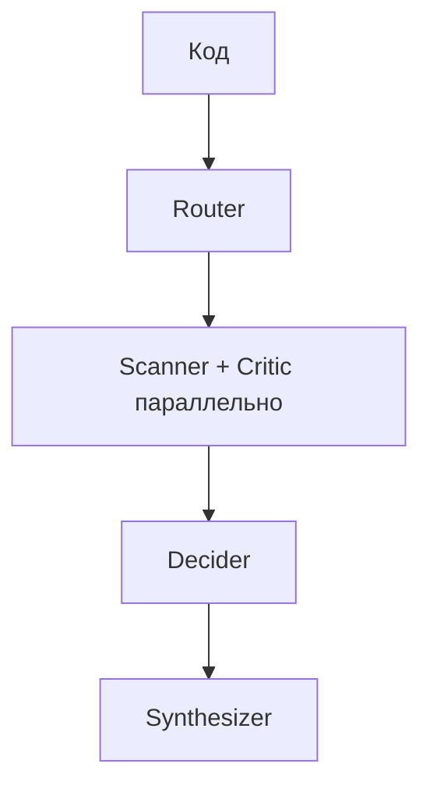

# Multi-Agent RAG — описание репозитория (MVP)

Кратко: dual-RAG для аудита кода — коллекция уязвимых примеров (`exploits`) и коллекция безопасных/похожих на FP (`false_positives`). Сейчас готов retrieval-слой MVP. Эмбеддинг-модель для MVP — лёгкая; для полной версии планируется замена (например code-embedding вроде Jina Code).



Из схемы реализовано: загрузка двух коллекций в Qdrant + функции поиска Scanner/Critic.

---

## Стек MVP (сейчас)

- Векторная БД: Qdrant
- Эмбеддинги: `BAAI/bge-small-en-v1.5` (dim **384**, cosine, `normalize_embeddings=True`)
- Префиксы BGE: документы `passage:`, запросы `query:`
- Датасет MVP: HuggingFace `LorenzH/juliet_test_suite_c_1_3`
  - поле `bad` → `exploits`
  - поле `good` → `false_positives`
  - CWE парсится из `filename` (`CWE126_...` → `"126"`), поле HF `class` **не** используется как CWE
- Лимит ingest: `MVP_MAX_SAMPLES = 800` строк на коллекцию
- В базе сейчас примерно: `exploits` ~4467 чанков, `false_positives` ~1242 чанка

Для полной модели (не MVP) ожидается смена эмбеддера и/или источника `/exploits` (Big-Vul). После смены модели коллекции нужно пересоздать под новый `VECTOR_SIZE` и перезалить векторы.

---

## Файлы проекта

### `config.py`

Общие константы MVP.

- `QDRANT_HOST` / `QDRANT_PORT`
- имена коллекций: `exploits`, `false_positives`
- `EMBEDDING_MODEL = "BAAI/bge-small-en-v1.5"`
- `VECTOR_SIZE = 384`
- `JULIET_DATASET = "LorenzH/juliet_test_suite_c_1_3"`
- `MVP_CWES` — опциональный фильтр CWE (пустой set = все)
- `MVP_MAX_SAMPLES = 800`
- два сплиттера:
  - **exploits:** `RecursiveCharacterTextSplitter(chunk_size=512, chunk_overlap=128)`
  - **false_positives:** `chunk_size=1024, chunk_overlap=256`  
    (другая стратегия специально: у FP крупнее контекст «почему безопасно»)

---

### `embeddings.py`

Обёртка над SentenceTransformer.

- `get_model()` — ленивая загрузка `BAAI/bge-small-en-v1.5`
- `embed_documents(texts)` — для upsert: префикс `passage:`, нормализация, список векторов `list[list[float]]`
- `embed_query(text)` — для поиска: префикс `query:`, один вектор

Токенизация отдельным этапом не делается: её выполняет tokenizer модели внутри `encode()` (BertTokenizer / WordPiece, max 512 токенов).

---

### `create_collections.py`

Создаёт в Qdrant две коллекции, если их ещё нет.

- vector size = `VECTOR_SIZE` (384)
- distance = cosine
- payload-index по полю `cwe` (keyword) — нужен фильтру Scanner’а

---

### `ingest_common.py`

Общая логика ingest (используется обоими load-скриптами).

- `load_juliet_rows("bad"|"good")` — читает HF Juliet, режет по `MVP_CWES` / `MVP_MAX_SAMPLES`, достаёт CWE из `filename`
- `chunk_rows(rows, splitter)` — режет код выбранным сплиттером, копирует метаданные в каждый чанк
- `upsert_chunks(collection_name, chunks)` — считает эмбеддинги через `embed_documents`, пишет в Qdrant батчами
- payload точки: `code`, `cwe`, `filename`, `source`, `kind`, `chunk_index`
- id точки: UUID

---

### `load_exploits.py`

Загрузка коллекции **Сканера** (`exploits`).

- вход: Juliet, поле `bad`
- сплиттер: exploits 512 / 128
- эмбеддинг: тот же BGE small (`passage:`)
- выход: точки в коллекции `exploits`

---

### `load_false_positives.py`

Загрузка коллекции **Критика** (`false_positives`).

- вход: Juliet, поле `good`
- сплиттер: FP 1024 / 256 (отдельно от exploits)
- эмбеддинг: тот же BGE small (`passage:`)
- выход: точки в коллекции `false_positives`

---

### `search_test.py`

Retrieval API + smoke-test на примере с `malloc`/`strcpy`.

**`search_exploits(code, cwe=None, limit=3)`** — Сканер

- коллекция: `exploits`
- query-эмбеддинг: BGE + `query:`
- опциональный filter по payload `cwe` (строка вида `"126"`)
- возвращает hits с score и payload

**`search_false_positives(code, limit=3)`** — Критик

- коллекция: `false_positives`
- тот же query-эмбеддинг
- **без** фильтра по CWE (независимый поиск)
- возвращает hits с score и payload

Это готовые функции, на которые садятся узлы Scanner / Critic в графе.

---

### `requirements.txt`

Зависимости MVP: `datasets`, `qdrant-client`, `sentence-transformers`, `langchain-text-splitters`, `langchain-core`, `tqdm`.

---

### `NOTES.md`

Рабочие заметки / черновики. Актуальное описание репозитория — этот `README.md`.

---

### `csecenv/notebook/notebook_fp.ipynb`

Ранний exploratory notebook: загрузка Juliet, просмотр `train`/`test`, конвертация в pandas. Боевой ingest уже в `.py` скриптах выше.

---

## Что лежит в Qdrant (контракт точки)

Каждая точка:

- `vector` — float[384]
- `payload.code` — текст чанка
- `payload.cwe` — `"126"` (без префикса `CWE-`)
- `payload.filename`
- `payload.source` — сейчас `"juliet"`
- `payload.kind` — `"bad"` или `"good"`
- `payload.chunk_index`

---

## Важные факты по текущей реализации

- Две коллекции, два чанкинга, один эмбеддер MVP.
- Critic не фильтрует по CWE Router’а.
- Scanner умеет фильтровать по CWE, если передать номер в формате payload (`"126"`).
- Модель эмбеддингов для полной версии будет меняться → нужны новый `VECTOR_SIZE`, recreate коллекций и полный re-ingest.
- Big-Vul в MVP ещё не подключён; `/exploits` сейчас из Juliet `bad`.

---

## Структура (корень репо)

```text
README.md
config.py
embeddings.py
create_collections.py
ingest_common.py
load_exploits.py
load_false_positives.py
search_test.py
requirements.txt
NOTES.md
csecenv/notebook/notebook_fp.ipynb
```
