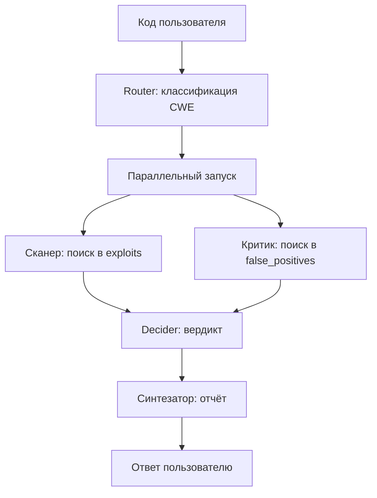

# Multi-Agent RAG — описание репозитория (MVP)

Кратко: dual-RAG для аудита кода — коллекция уязвимых примеров (`exploits`) и коллекция безопасных/похожих на FP (`false_positives`). Сейчас готов retrieval-слой MVP. Эмбеддинг-модель для MVP — лёгкая; для полной версии планируется замена (например code-embedding вроде Jina Code).



Из схемы реализовано: загрузка двух коллекций в Qdrant, поиск Scanner/Critic, Router (Ollama), простой Decider и eval retrieval-метрик.

---

## Стек MVP (сейчас)

- Векторная БД: Qdrant
- Эмбеддинги: `BAAI/bge-small-en-v1.5` (dim **384**, cosine, `normalize_embeddings=True`)
- Префиксы BGE: документы `passage:`, запросы `query:`
- Router: `qwen2.5-coder:7b` через Ollama (`router.py`)
- Датасет MVP: `data/dataset.jsonl` (Juliet C/C++, подготовка Насти)
  - `kind=bad` → `exploits`, `kind=good` → `false_positives`
  - 5 CWE: 78, 134, 190, 23, 476
  - после чистки: bad ≈ 1741, good = 2370 (убраны source-only и `POTENTIAL FLAW`)
  - CWE в payload: `CWE78` (Router отдаёт `CWE-78`, нормализуется)
- `MVP_MAX_SAMPLES = None` → грузим весь jsonl
- Eval: `evals/` (recall@k, decision accuracy → `results.jsonl` / MLflow)

Для полной модели (не MVP) ожидается смена эмбеддера и/или источника `/exploits` (Big-Vul). После смены модели коллекции нужно пересоздать под новый `VECTOR_SIZE` и перезалить векторы.

---

## Файлы проекта

### `config.py`

Общие константы MVP.

- `QDRANT_HOST` / `QDRANT_PORT`
- имена коллекций: `exploits`, `false_positives`
- `EMBEDDING_MODEL = "BAAI/bge-small-en-v1.5"`
- `VECTOR_SIZE = 384`
- `DATASET_PATH = data/dataset.jsonl`
- `MVP_CWES` — опциональный фильтр CWE (пустой set = все)
- `MVP_MAX_SAMPLES = None` (весь датасет)
- два сплиттера:
  - **exploits:** `RecursiveCharacterTextSplitter(chunk_size=512, chunk_overlap=128)`
  - **false_positives:** `chunk_size=1024, chunk_overlap=256`  
    (другая стратегия специально: у FP крупнее контекст «почему безопасно»)

---

### `embeddings.py`

Обёртка над SentenceTransformer.

- `get_model()` — ленивая загрузка `BAAI/bge-small-en-v1.5`
- `embed_documents(texts)` — для upsert: префикс `passage:`, нормализация, список векторов `list[list[float]]`
- `embed_query(text)` — для поиска: префикс `query:`, один вектор

Токенизация отдельным этапом не делается: её выполняет tokenizer модели внутри `encode()` (BertTokenizer / WordPiece, max 512 токенов).

---

### `create_collections.py`

Создаёт в Qdrant две коллекции, если их ещё нет.

- vector size = `VECTOR_SIZE` (384)
- distance = cosine
- payload-index по полю `cwe` (keyword) — нужен фильтру Scanner’а

---

### `ingest_common.py`

Общая логика ingest (используется обоими load-скриптами).

- `normalize_cwe(...)` — `CWE-78` / `78` / `CWE78` → `CWE78`
- `load_dataset_rows("bad"|"good")` — читает `data/dataset.jsonl`
- `chunk_rows(rows, splitter)` — режет код выбранным сплиттером
- `upsert_chunks(collection_name, chunks)` — эмбеддинги + upsert
- payload: `code`, `cwe`, `filename`, `function_name`, `label`, `source`, `kind`, `chunk_index`

---

### `load_exploits.py`

Загрузка коллекции **Сканера** (`exploits`).

- вход: `dataset.jsonl`, `kind=bad`
- сплиттер: exploits 512 / 128
- эмбеддинг: BGE small (`passage:`)

---

### `load_false_positives.py`

Загрузка коллекции **Критика** (`false_positives`).

- вход: `dataset.jsonl`, `kind=good`
- сплиттер: FP 1024 / 256
- эмбеддинг: BGE small (`passage:`)

---

### `search_test.py`

Retrieval API + smoke-test (пример path traversal / CWE23).

**`search_exploits(code, cwe=None, limit=3)`** — Сканер

- коллекция: `exploits`
- query-эмбеддинг: BGE + `query:`
- опциональный filter по payload `cwe` (`"CWE23"` после normalize)
- возвращает hits с score и payload

**`search_false_positives(code, limit=3)`** — Критик

- коллекция: `false_positives`
- тот же query-эмбеддинг
- **без** фильтра по CWE (независимый поиск)
- возвращает hits с score и payload

Это готовые функции, на которые садятся узлы Scanner / Critic в графе.

---

### `requirements.txt`

Зависимости MVP: `datasets`, `qdrant-client`, `sentence-transformers`, `langchain-text-splitters`, `langchain-core`, `tqdm`.


## Что лежит в Qdrant (контракт точки)

Каждая точка:

- `vector` — float[384]
- `payload.code` — текст чанка
- `payload.cwe` — `"CWE78"`
- `payload.filename`, `payload.function_name`, `payload.label`
- `payload.source` — `"dataset.jsonl"`
- `payload.kind` — `"bad"` или `"good"`
- `payload.chunk_index`

---

## Важные факты по текущей реализации

- Две коллекции, два чанкинга, один эмбеддер MVP.
- Critic не фильтрует по CWE Router’а.
- Scanner фильтрует по CWE; `normalize_cwe` принимает `CWE-78` / `CWE78` / `78`.
- Модель эмбеддингов для полной версии может смениться → recreate + re-ingest.
- Big-Vul пока не подключён; источник MVP — `data/dataset.jsonl`.

---

## Структура (корень репо)

```text
README.md
config.py
embeddings.py
create_collections.py
ingest_common.py
load_exploits.py
load_false_positives.py
search_test.py
router.py
test_router.py
decider.py
evals/
  build_cases.py
  eval_retrieval.py
  cases.jsonl
data/dataset.jsonl
requirements.txt
```

### Eval / метрики

```powershell
.\csecenv\Scripts\python.exe evals\build_cases.py
.\csecenv\Scripts\python.exe evals\eval_retrieval.py
```

Пишет:
- `evals/results.jsonl` — история прогонов
- `mlruns/` — если установлен MLflow

Считаем сейчас: Scanner/Critic recall@k, mean top-1 cosine, decision accuracy (proxy Decider).  
`faithfulness` / `router_accuracy` зарезервированы до Синтезатора и полного Router-eval.
