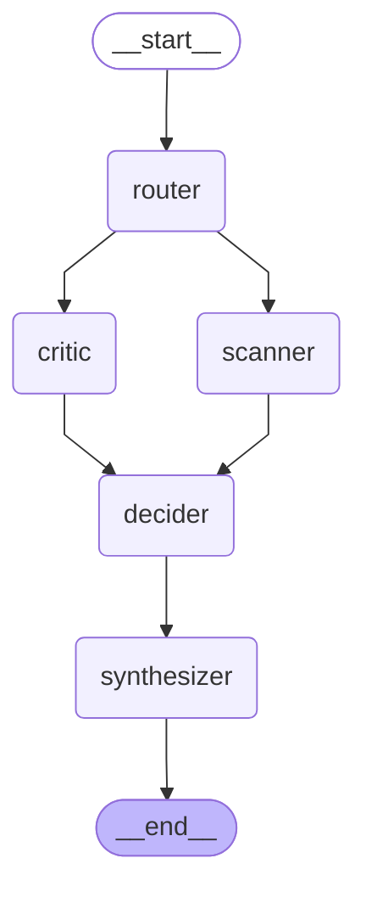

# Структура графа

```mermaid
---
config:
  flowchart:
    curve: linear
---
graph TD;
	__start__([<p>__start__</p>]):::first
	router(router)
	scanner(scanner)
	critic(critic)
	decider(decider)
	synthesizer(synthesizer)
	__end__([<p>__end__</p>]):::last
	__start__ --> router;
	critic --> decider;
	decider --> synthesizer;
	router --> critic;
	router --> scanner;
	scanner --> decider;
	synthesizer --> __end__;
	classDef default fill:#f2f0ff,line-height:1.2
	classDef first fill-opacity:0
	classDef last fill:#bfb6fc
```
